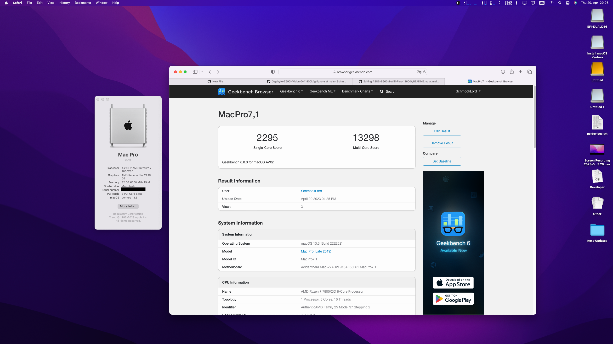
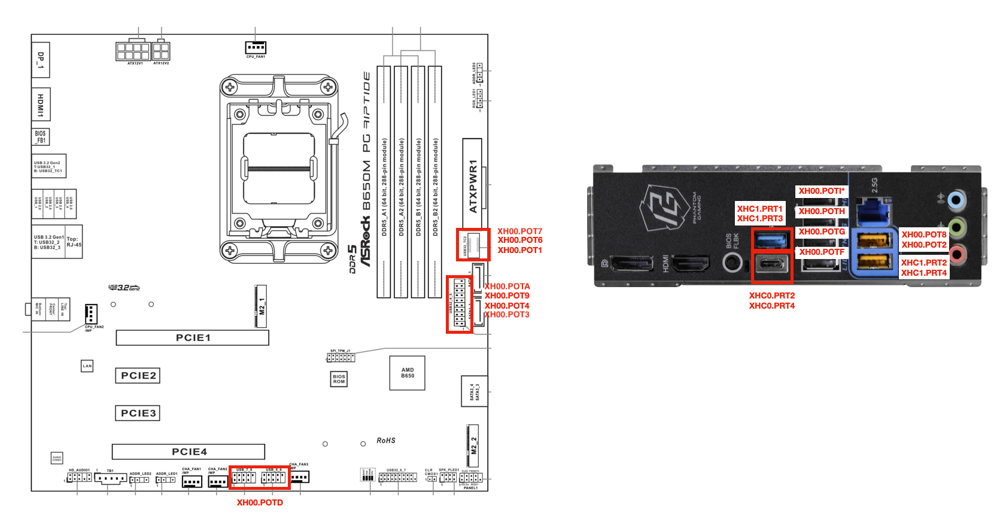

# Hackintosh-ASRock-B650M-Riptide-7800X3D

# Current macOS

Current Version: macOS Sonoma 14.5

# Special Notes 

Note 1: I highly recommend sticking to BIOS 1.30.AS05 [Beta]. Whenever I tried something newer, I experienced restarts with BIOS-resets instead of a shutdown from macOS. I experienced that on my ASROCK B650M Riptide PG and now on the B650M Pro R/S Wifi. I also noticed no performance increase with BIOS afterwards. Always get the same Benchmarks results e.g. with 2.10 or even the newest 3.01.

Note 2: In Windows 11 Disable USB-Selective Suspend in every Energy Profile. This can cause Framedrops in Games, I had issues with random FPS drops every couple of hours using Pico 4 and Quest 3 VR Headsets. And I think I also noticed this in Valorant.

# Hardware
- CPU: AMD Ryzen 7 7800X3D
- Board: ASRock B650M Riptide
- RAM: 32 GB (2x16GB) Kingston DDR5 6000Mhz CL32
- GPU: MSI Gaming Trio X 6900 XTX
- PSU: Corsair SF750
- Case: Asus AP201 (Micro-ATX)
- Wifi/BT: Fenvi T919 with Broadcom Chipset

# Working
- CPU Power Management
- USB Ports
- Sleep/Wake
- Wifi/BT

# Not working
iGPU, but this is common. You should disable it in BIOS or via Device Properties just for macOS.

# BIOS Settings

I highly recommend sticking to BIOS 1.30.AS05 [Beta], see special notes above.

You can use the default settings, no change required for macOS. Above 4G Decording etc. are all already Enabled.

The only things I do to improve performance: XMP Profile (in my case 6000Mhz), RAM Timings to Aggressive. Memory Restore Context to Enabled. And Soc/Uncore Voltage to 1.25V.

I also let Fast Boot Enabled, no issues so far.

Only if you need Secure Boot (Enable Secure Boot, Secure Boot Mode to Custom and then in the Key Management all .efi files in your EFI-folder need to be enrolled/whitelisted with "Enroll this EFI").

# USB Port Mapping

USB-Port Mapping is done via `SSDT-USB-B650M-Riptide.aml`:
- `XH00` is defined in `DSDT.aml`. 
- `XHC0`, `XHC1` and `XHC2` are defined in `SSDT-USB.aml`. 
- I had to fix all errors in `DSDT.aml` and removed USB-port definition from the `DSDT.aml`. 
- I also deleted the original `SSDT-USB.aml`. 
- The USB-Port Mapping for all controllers is in the `SSDT-USB-B650M-Riptide.aml`.

# Notes

- **iGPU is causing a crash on wake if enabled**. Disable iGPU in BIOS or disable it via Device Properties in your config.plist just for macOS
- **Two Keypresses to wake display after sleep** was solved by using `SSDT-USBW.aml` + `USBWakeFixup.kext` + Adding `acpi-wake-type=01` for every USB controller (`XH00`, `XHC0`, `XHC1` and `XHC2`) in the device properties.
